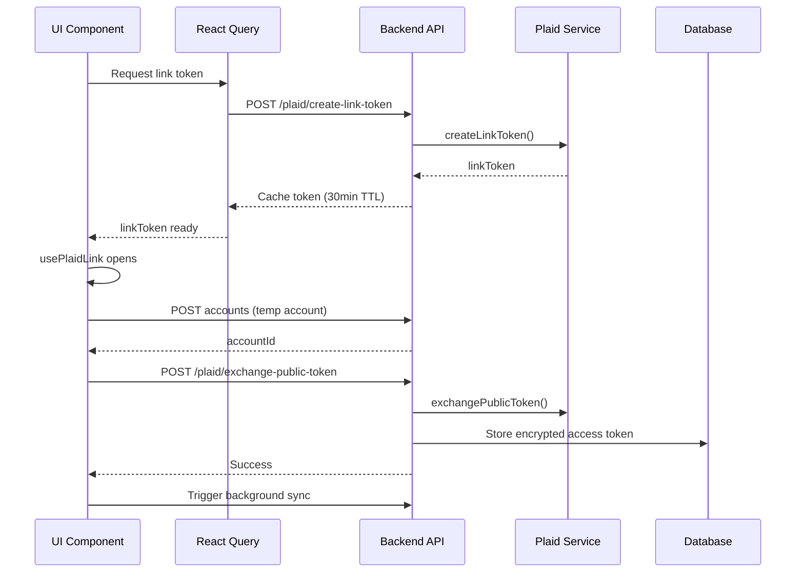

# WeBudget Plaid Integration Standardization - Architectural Design

**Version**: 1.0  
**Date**: September 19, 2025  
**Author**: AI Assistant  
**Status**: READY FOR IMPLEMENTATION

## 1. High-Level Approach

### Design Philosophy
Build upon the successful `Accounts.tsx` pattern to create a **unified Plaid integration approach** that maintains existing backend services while standardizing frontend components for consistency, security, and maintainability.

### Core Strategy
- **Template Pattern**: Use `Accounts.tsx` `usePlaidLink` approach as the canonical pattern
- **Minimal Backend Changes**: Leverage existing `PlaidService` and `PlaidSyncService` 
- **Session-Level Token Management**: Enhance React Query caching for optimal security/UX
- **Progressive Refactoring**: Phase rollout (Dashboard → Onboarding → Enhancement)

## 2. Component Breakdown

### 2.1 Frontend Components to Modify

#### **A. Dashboard.tsx** (Phase 1 - Highest Priority)
**Current State**: Uses `ConnectAccountModal` with separate modal pattern  
**Target State**: Direct `usePlaidLink` integration following Accounts.tsx pattern

**Changes Required**:
- Remove `ConnectAccountModal` dependency
- Add direct Plaid link token query
- Implement `usePlaidLink` hook with account creation flow
- Replace modal trigger with direct connection button
- Add `ErrorBoundary` wrapper (already exists but verify consistency)

**Risk Level**: Low (Dashboard has simple connect button, minimal UX impact)

#### **B. Onboarding.tsx** (Phase 2 - Moderate Priority) 
**Current State**: Step-based flow with `PlaidErrorBoundary` and different token management  
**Target State**: Standard integration while preserving onboarding UX flow

**Changes Required**:
- Replace `PlaidErrorBoundary` with standard `ErrorBoundary`
- Standardize token creation and `usePlaidLink` usage
- Maintain step-based UX but use consistent Plaid integration underneath
- Preserve onboarding completion logic

**Risk Level**: Medium (Complex UX flow, need to preserve onboarding experience)

#### **C. ConnectAccountModal.tsx** (Phase 3 - Deprecation)
**Current State**: Modal-based Plaid integration using direct Plaid.create()  
**Target State**: Remove or refactor as utility hook

**Changes Required**:
- Evaluate if modal is needed elsewhere in codebase
- If needed, refactor to use standard `usePlaidLink` pattern internally
- If not needed, deprecate and remove

**Risk Level**: Low (Self-contained component)

### 2.2 Backend Components (Leverage Existing)

#### **Existing Services (No Changes)**
- `PlaidService` - Well-architected service layer, properly implements Clean Architecture
- `PlaidSyncService` - Background synchronization functionality 
- `plaid.routes.ts` - Proper authentication middleware and endpoint structure
- Controllers follow established patterns

#### **Enhancement Areas**
- Token caching strategy in frontend API layer
- Error response standardization (already well-implemented)

## 3. Data Models

### 3.1 Frontend Types (Enhance Existing)

```typescript
// Enhanced token management types
interface PlaidLinkTokenCache {
  token: string;
  expires_at: number;
  user_id: string;
}

// Standardized Plaid connection state
interface PlaidConnectionState {
  isReady: boolean;
  isConnecting: boolean;
  error: PlaidError | null;
  linkToken: string | null;
}

// Standardized account creation flow
interface AccountCreationFlow {
  tempAccount: InsertAccount;
  plaidPublicToken: string;
  selectedAccountId: number;
}
```

### 3.2 Backend Schema (Maintain Existing)

**No changes required** - existing `accounts` table schema supports:
- `plaidAccessToken` - Encrypted storage
- `plaidItemId` - Plaid item reference
- `isConnected` - Connection status

## 4. API Contracts

### 4.1 Existing Endpoints (Maintain)
- `POST /api/v1/plaid/create-link-token` - Link token generation
- `POST /api/v1/plaid/exchange-public-token` - Token exchange
- Authentication via JWT middleware (existing)

### 4.2 Enhanced Frontend API Layer

```typescript
// Enhanced backendApi.ts functions
export async function createPlaidLinkTokenCached(): Promise<PlaidLinkTokenResponse> {
  // Use React Query with 30-minute TTL
  // Implement session-level caching
  // Auto-refresh on auth state changes
}

export async function getAccountCreationDefaults(): Promise<InsertAccount> {
  // Provide consistent account creation defaults
  // Maintain existing create-first, update-later pattern
}
```

## 5. Key Interactions & Component Flow

### 5.1 Standardized Plaid Integration Pattern

```typescript
// Template pattern used across all components
function useStandardPlaidIntegration() {
  const { data: linkToken, isLoading } = useQuery(
    ['plaidLinkToken'],
    createPlaidLinkTokenCached,
    { staleTime: 30 * 60 * 1000 } // 30 minutes
  );

  const { open, ready } = usePlaidLink({
    token: linkToken || "",
    onSuccess: async (publicToken) => {
      // 1. Create account (if needed)
      // 2. Exchange token
      // 3. Trigger background sync
      // 4. Update UI state
    },
    onExit: handleStandardError
  });

  return { connectAccount: () => ready && open(), isReady: ready && !!linkToken };
}
```

### 5.2 Account Creation Flow



## 6. Integration Points

### 6.1 React Query Integration
- **Cache Strategy**: 30-minute TTL for link tokens
- **Invalidation**: On auth state changes, connection success
- **Error Handling**: Standard retry policies with exponential backoff

### 6.2 ErrorBoundary Integration
- **Standard Pattern**: Use existing `ErrorBoundary` component everywhere
- **Error Reporting**: Consistent error messages and recovery flows
- **Fallback UI**: Graceful degradation for Plaid connection failures

### 6.3 Authentication Integration
- **JWT Tokens**: Maintain existing Supabase authentication flow
- **Session Management**: Link token lifecycle tied to auth session
- **Security**: Token invalidation on logout/session expiry

## 7. Phase 2 Decisions Impact

### 7.1 User Clarification Impact on Design

1. **"usePlaidLink everywhere"** → Template pattern approach, eliminate modal variations
2. **"Most secure without breaking schema"** → Session-level caching, existing DB schema
3. **"Standard ErrorBoundary"** → Remove `PlaidErrorBoundary`, use consistent pattern
4. **"Simplest for maintainability"** → Single template pattern, leverage existing services
5. **"Session-level tokens"** → React Query caching with 30-minute TTL
6. **"Both manual and Plaid data"** → Preserve existing account creation flow
7. **"Both unit and integration tests"** → Comprehensive testing strategy

### 7.2 Design Alignment with Decisions
- **Standardization**: Single `useStandardPlaidIntegration` hook
- **Security**: Session-level token management without localStorage
- **Maintainability**: Template pattern reduces code duplication
- **Flexibility**: Preserves manual account creation alongside Plaid sync

## 8. Complexity Factors & Mitigation

### 8.1 High Complexity Areas
1. **Onboarding UX Preservation** - Complex step-based flow needs careful refactoring
2. **Token Lifecycle Management** - Session persistence without security compromise
3. **Data Consistency** - Manual vs Plaid data synchronization

### 8.2 Risk Mitigation Strategies
- **Progressive Rollout**: Dashboard first (lowest risk) → Onboarding (preserve UX)
- **Feature Flags**: Gradual rollout capability if needed
- **Comprehensive Testing**: Unit + integration tests for all flows
- **Backward Compatibility**: No breaking changes to existing patterns

## 9. Pattern Alignment & File References

### 9.1 Successful Patterns to Replicate
- **`/client/src/pages/Accounts.tsx`** (Lines 58-95): Excellent token management and `usePlaidLink` usage
- **`/server/src/services/plaid.service.ts`**: Clean Architecture service layer
- **`/server/src/api/routes/plaid.routes.ts`**: Proper auth middleware patterns

### 9.2 Patterns to Replace
- **`/client/src/components/modals/ConnectAccountModal.tsx`** (Lines 1-100): Direct Plaid.create() usage
- **`/client/src/pages/Onboarding.tsx`**: `PlaidErrorBoundary` usage
- **Various pages**: Inconsistent token management approaches

### 9.3 Architectural Patterns to Maintain
- Clean Architecture: Controllers → Services → Repositories
- React Query for API state management
- ErrorBoundary for component resilience
- TypeScript strict typing throughout

## 10. User Rules Compliance

### 10.1 Architecture Rules ✅
- **Clean Architecture**: Maintained - leveraging existing service layer
- **Security First**: Enhanced - session-level token management
- **Error Boundaries**: Standardized - consistent ErrorBoundary usage

### 10.2 Development Rules ✅  
- **TypeScript**: Full typing for all new interfaces and functions
- **React Query**: Leveraged for token caching and API state
- **Component Structure**: Consistent import patterns and organization
- **Testing Strategy**: Both unit and integration tests planned

### 10.3 Process Rules ✅
- **Conventional Commits**: Implementation will follow `feat(plaid): standardize integration`
- **Feature Branches**: `feat/plaid-integration-standardization`
- **High Automation**: Auto-approve implementation decisions with >8/10 confidence

## Implementation Readiness

**Design Status**: ✅ Complete - Ready for implementation planning  
**Risk Assessment**: Medium complexity with well-defined mitigation strategies  
**Dependencies**: None - all required services and patterns exist  
**Backward Compatibility**: ✅ Maintained - no breaking changes

---

**Next Phase**: Implementation Planning - Create detailed step-by-step implementation tasks